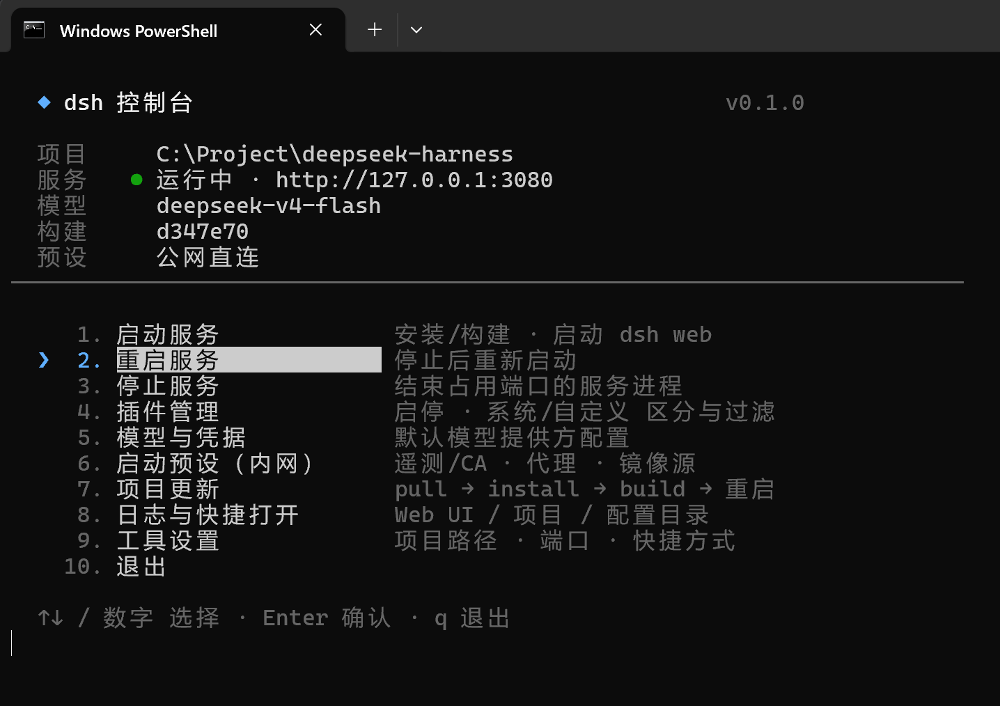

# dsh-console

一个纯 Windows 控制台小工具，帮你**启动 / 重启 / 停止 / 配置**本机的
[deepseek-harness](https://github.com/deepseek-ai/deepseek-harness)（下称 dsh）Web 服务，并顺手管理插件与默认模型。



## 快速开始

1. 把整个 `dsh-console` 文件夹放到任意位置（不必放在 dsh 目录里）。
2. 双击 **`启动.bat`**。
   - 本机没有合适的 Node.js（`22.19+` 或 `24+`）时，会自动下载便携版到 `%LOCALAPPDATA%\dsh-console\runtime`，无需管理员权限。
   - 首次运行走四步向导：选 dsh 项目路径 → 环境检查 → 安装/构建 → （可选）设默认模型。
3. 回主界面，选 **启动服务**。之后每次双击 `启动.bat` 直达主菜单。

## 功能一览

| 菜单 | 做什么 |
|---|---|
| **启动 / 重启 / 停止服务** | 端口占用检查 → 按需 install/build → 启动 `dsh web`；占用端口的旧进程自动结束。 |
| **插件管理** | 合并展示启动时加载的插件，系统/自定义以符号+颜色区分；`空格` 启停，改动重启后生效。 |
| **模型与凭据** | 配置新会话默认模型：填 OpenAI 兼容端点 + API Key（自动拉模型列表），或填 `DEEPSEEK_API_KEY`；写入即热生效。 |
| **启动预设（内网）** | 关遥测、注入 CA 证书、设代理与镜像源。 |
| **项目更新** | `git pull --ff-only` → install → build →（可选）重启。 |
| **日志 / 快捷打开** | 打开 Web UI、项目目录、`~/.dsh`、工具日志目录。 |
| **工具设置** | 改项目路径/端口/自动开浏览器，建桌面快捷方式。 |

操作：`↑↓` 或行首数字移动高亮，`Enter` 确认，`Esc` 返回，主界面 `q` 退出。

## 说明

- 插件与模型改动一般写在 `~/.dsh` 下的官方配置里（`settings.yaml` / `.credentials.yaml`），均保留你原有内容与注释，可热加载。
- 本工具自己只落盘 `config.json` 与 `data\`（均不入库、不含机密，明文 Key 只进 `~/.dsh/.credentials.yaml`）。
- 启动报错时，菜单里有「打开工具日志目录」，查看 `data\logs\*.log`。

## 开发

```
npm test      # 单元测试（node:test，进程内运行）
```

结构：`bootstrap\check-env.ps1`（引导 Node）、`app\main.js`（入口装配）、`app\core\*`（config / lifecycle / pipeline / plugins / model / presets …）、
`app\pages\*`（各功能页）、`app\ui\*`（ANSI 无框 TUI 层）。

## License

[MIT](LICENSE) © LaughTale-0202
